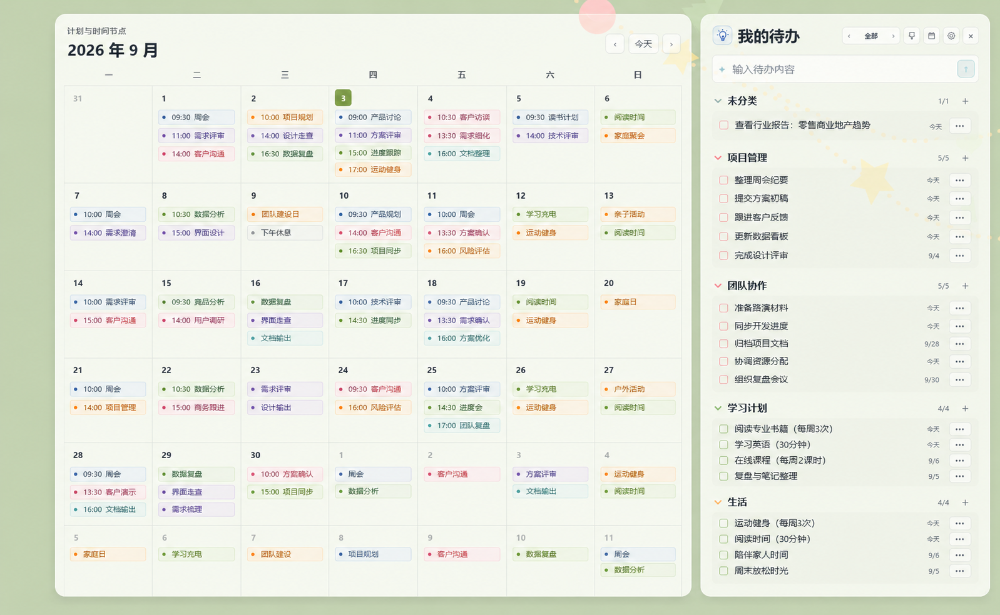

# Luma Todo

一个轻量的 Windows 桌面待办与月历工具。

## 下载 当前版本：v1.2.0

**[下载最新版 Luma Todo](https://github.com/kfanbelinda-commits/luma-todo/releases/latest)**

推荐下载 `Luma-Todo-Setup-1.2.0.zip`，解压后运行其中的 `Luma-Todo-Setup-1.2.0.exe`；也可以直接下载 `.exe` 安装。其他 Assets 无需手动下载。

> Windows 首次安装可能出现 SmartScreen 提示，因为当前安装包暂未使用代码签名证书。

## 功能

- 桌面待办与月历
- 顶部显示公历日期与星期，月历中显示完整农历日期
- 点击月历日期可查看当天日程，以及当天和之前仍未完成的待办；右侧待办列表保持不变
- 日期详情以轻量浮层显示，支持点击空白区域、再次点击日期、Esc 或 × 关闭
- 分类管理与任务拖拽
- 中文日期、时间识别
- 今日任务与逾期顺延
- Google Tasks 双向同步
- Google Calendar 日程同步
- Apple / iCloud Calendar 双向日程同步
- 有日期的 Todo 可镜像到 Apple Calendar
- 深色 / 浅色模式
- 0%–100% 窗口背景透明度、桌面层常驻、Pin 窗口置顶、开机启动
- 本地保存、每日备份、手动导出
- 自动检查并安装新版本

## Google 同步

连接 Google 账号后：

- 普通任务、日期任务 → Google Tasks
- 日程任务 → Google Calendar
- Google Calendar 原有日程 → Luma 中只读显示
- 分类信息可随 Google 同步到其他设备

iPhone 可以使用 **Google Tasks** 查看全部待办，也可以使用 **Google Calendar** 查看有日期的任务和日程。

## 数据与隐私

Luma Todo 的任务和备份保存在本机。

Google 登录令牌与 Apple/iCloud 登录凭据均使用本地安全存储保存。项目不收集遥测数据，个人任务、日历数据和登录信息不会上传到 GitHub。

## 使用说明

详细的新建、编辑、拖动、分类和同步操作，请查看《Luma Todo 产品使用说明书》。

